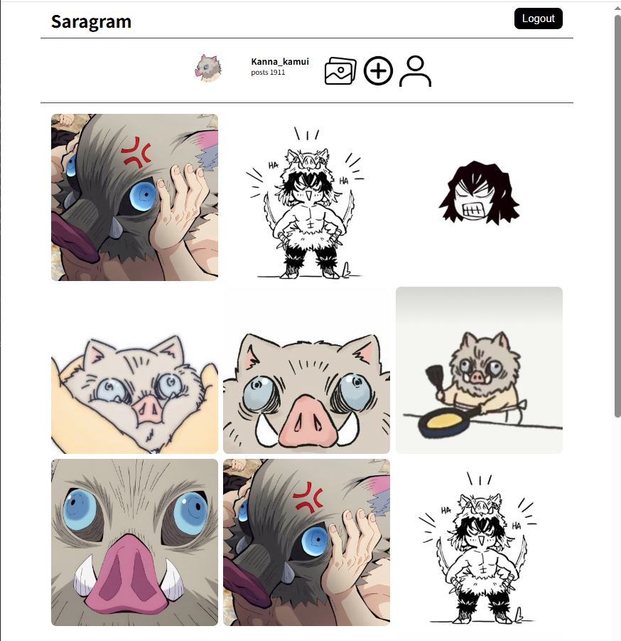

# sara-s-personal-project  
my website

# SARAGRAM DESIGN.

<div align="center">
  
</div>

<br><br>

## About Me

> **"코드는 단순한 논리의 집합이 아니라, 경험을 설계하는 도구입니다."**

저는 구조와 효율성, 그리고 사용자 경험의 흐름에 집착하는 **풀스택 개발자**입니다.  
복잡한 기술을 과시하기보다는, 불필요한 요소를 덜어내고 서비스의 본질과 유용성을 드러내는 데 집중합니다.

소셜 미디어부터 공공 데이터 기반의 실시간 서비스, 그리고 B2B 물류 플랫폼까지  
다양한 도메인의 프로젝트를 직접 설계·구현하며  
구조적이면서도 확장 가능한 개발을 지향해 왔습니다.

사용자가 말하기 전에 먼저 필요한 것을 읽어내고,  
그 흐름을 코드로 구현하는 것이 개발자의 역할이라고 믿습니다.

현재 **한국**을 거점으로 활동 중이며, 새로운 프로젝트 제안은 언제나 환영합니다.

<br><br>

## About Me (EN)

> **"Code is not just about logic; it's about crafting an experience."**

I am a **Full-Stack Developer** obsessed with structure, efficiency, and the flow of user experience.  
Rather than showcasing complexity, I focus on stripping systems down to their core value and purpose.

From social media platforms to real-time public data services and B2B logistics solutions,  
I have designed and built diverse applications with a structured yet flexible approach.

I believe a developer’s role is not just to write code,  
but to anticipate user needs and translate them into seamless experiences.

Based in **Korea**, open to global collaboration.
<br>

# 프로젝트 구조
````
saragram/
├── client/             # Vite + React (PWA)
│   ├── src/                # React 실행 관련 로직
│   │   ├── assets/             # 비공개 정적 파일
│   │   ├── config/             # 설정 파일 (환경 변수, API 엔드포인트, Firebase/Web Push 설정 등)
│   │   ├── components/         # 컴포넌트
│   │   ├── routes/             # React 라우터
│   │   ├── store/              # 리덕스 관련
│   │   │   ├── slices/            # 리덕스 슬라이스 관련
│   │   │   └── store.js
│   │   ├── utils/              # 유틸
│   │   ├── App.jsx
│   │   ├── main.jsx
│   │   └── sw.js               # service-worker 파일
│   ├── index.html
│   └── vite.config.js
│
├── server/             # Express
│   ├── app/                # Express 실행 관련 로직
│   │   ├── controllers/        # 컨트롤러 레이어 (유효성 검사 & Request·Response 시 데이터 가공 처리 & 비지니스 로직으로의 연결)
│   │   ├── middlewares/        # 미들웨어 (JWT 인증, 권한 체크, 에러 핸들링, 로깅 등)
│   │   ├── models/             # 모델 (Sequelize 등 모델)
│   │   ├── repositories/       # DB 접근 레이어
│   │   ├── services/           # 비즈니스 로직 레이어
│   │   └── utils/              # 유틸
│   ├── configs/                # 전역 설정 파일 (DB, JWT, OAuth, Push 등)
│   ├── database/           # 데이터베이스 관련
│   │   ├── migrations/         # 마이그레이션 (DB 스키마 작성 파일 등)
│   │   └── seeders/            # 시더 (DB 더미 데이터 생성 파일 등)
│   ├── routes/             # API 엔드포인트 정의
│   ├── storage/            # 정적 파일을 서빙 디렉토리 (업로드 파일, PWA build 결과물 저장소), 주의: 운영환경은 경로 다름 
│   ├── app.js              # API 엔트리 포인트
│   └── .env                # 환경 변수 설정 파일
└── READEME.md
````

<br>

# ERD


<br>

# 설치 라이브러리
### client
````
npm create vite@latest .
npm i dayjs react-router-dom @reduxjs/toolkit react-redux axios jwt-decode
npm install -D vite-plugin-pwa
````

### server
````
npm init
npm i express express-validator morgan winston dotenv sequelize sequelize-cli mysql2 cookie-parser jsonwebtoken cors multer swagger-ui-express yaml dayjs bcrypt web-push swagger-ui-express swagger-parser
npm install -D nodemon
````

# DB 테이블 설계안
### users (회원 정보)
| 컬럼명           | 타입                              | 설명          |
| ------------- | ------------------------------- | ----------- |
| id            | BIGINT PK AUTO_INCREMENT        | 사용자 ID      |
| email         | VARCHAR(100) UNIQUE             | 이메일(로그인용)   |
| password      | VARCHAR(255)                    | 비밀번호(해시 저장) |
| nick          | VARCHAR(20) UNIQUE                    | 닉네임         |
| provider      | VARCHAR(10)                     | 로그인 제공자(local, google, kakao 등)     |
| role          | VARCHAR(10)                     | 권한(user, admin 등)          |
| profile | VARCHAR(100)                    | 프로필 이미지 경로  |
| refresh_token | VARCHAR(255)                    | 프로필 이미지 경로  |
| created_at    | DATETIME                        | 가입일         |
| updated_at    | DATETIME                        | 수정일         |
| deleted_at    | DATETIME                        | 삭제일         |

### posts (게시글)
| 컬럼명        | 타입                   | 설명         |
| ---------- | -------------------- | ---------- |
| id         | BIGINT PK AUTO_INCREMENT         | 게시글 ID     |
| user_id    | BIGINT FK(users.id)  | 작성자 ID     |
| title      | VARCHAR(200)         | 제목         |
| content    | VARCHAR(1000)                 | 본문         |
| image  | VARCHAR(100)         | 업로드 이미지 경로 |
| created_at    | DATETIME                        | 가입일         |
| updated_at    | DATETIME                        | 수정일         |
| deleted_at    | DATETIME                        | 삭제일         |

### comments (댓글)
| 컬럼명        | 타입                  | 설명         |
| ---------- | ------------------- | ---------- |
| id         | BIGINT PK AUTO_INCREMENT        | 댓글 ID      |
| post_id    | BIGINT FK(posts.id) | 댓글이 달린 게시글 |
| user_id    | BIGINT FK(users.id) | 작성자        |
| content    | VARCHAR(1000)                | 댓글 내용      |
| created_at    | DATETIME                        | 가입일         |
| updated_at    | DATETIME                        | 수정일         |
| deleted_at    | DATETIME                        | 삭제일         |

### likes (좋아요)
| 컬럼명        | 타입                  | 설명         |
| ---------- | ------------------- | ---------- |
| id         | BIGINT PK AUTO_INCREMENT        | 좋아요 ID     |
| post_id    | BIGINT FK(posts.id) | 좋아요 대상 게시글 |
| user_id    | BIGINT FK(users.id) | 누른 사용자     |
| created_at    | DATETIME                        | 가입일         |
| updated_at    | DATETIME                        | 수정일         |
| deleted_at    | DATETIME                        | 삭제일         |

### notifications (PWA 푸시용)
| 컬럼명        | 타입                   | 설명     |
| ---------- | -------------------- | ------ |
| id         | BIGINT PK AUTO_INCREMENT         | 알림 ID  |
| user_id    | BIGINT FK(users.id)  | 알림 대상자 |
| title      | VARCHAR(200)         | 알림 제목  |
| message    | VARCHAR(2000)                 | 알림 내용  |
| is_read    | TINYINT(1) DEFAULT 0 | 읽음 여부  |
| created_at    | DATETIME                        | 가입일         |
| updated_at    | DATETIME                        | 수정일         |
| deleted_at    | DATETIME                        | 삭제일         |

### push_subscriptions (댓글 푸시 정보)
| 컬럼명        | 타입                  | 설명                |
| ---------- | ------------------- | ----------------- |
| id         | BIGINT PK AUTO_INCREMENT        | 구독 ID             |
| user_id    | BIGINT FK(users.id) | 유저                |
| endpoint   | VARCHAR(255)                | Push API endpoint |
| p256dh     | VARCHAR(255)                | 공개키               |
| auth       | VARCHAR(255)                | 인증키               |
| created_at    | DATETIME                        | 가입일         |
| updated_at    | DATETIME                        | 수정일         |
| deleted_at    | DATETIME                        | 삭제일         |


# 관습적인 CRUD 메소드명
````
index: 데이터 조회 처리 (리스트 페이지 or 리스트 데이터 획득)
show: 상세 조회 처리 (상세 페이지 or 상세 데이터 획득)
create: 작성 페이지 출력 X
store: 새로운 데이터 작성 처리  
edit: 수정 페이지 출력 X
update: 데이터 수정 처리  
destroy: 데이터 삭제  
````
